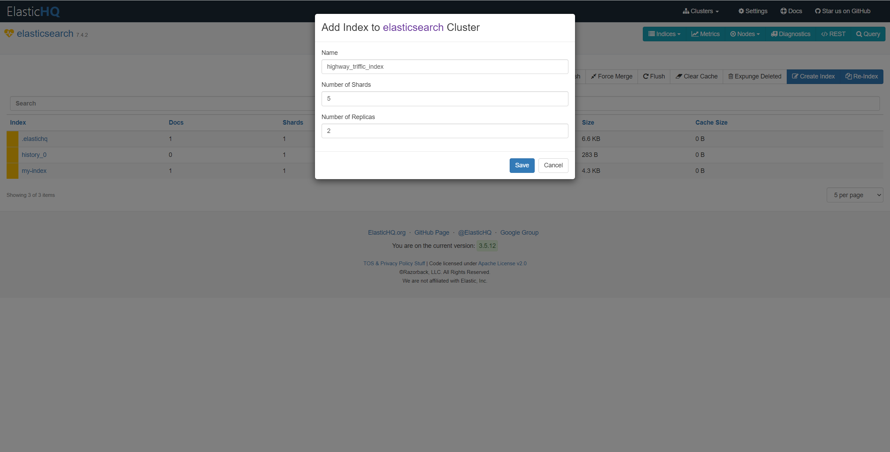

# 数字底座接入文档

-- --

## 应用介绍

数字底座为不同渠道应用提供两种方式的数据接入，任意格式的文件和文本数据。可以是加工和未加工的数据形式。数字底座具备多路并发数据分发能力。

## 主要功能：

### 1.用户权限体系

调用数字底座能力时，离不开调用服务端接口，这些操作会访问用户，操作用户的信息。在实际使用过程中，应用需要申请资源访问的权限，并经过开放平台
或者租户管理员审核后，才可以使用权限绑定的开放能力。开发者可以进入开发者后台，在权限管理页面的权限配置区域，批量开通所需的api权限和对应的插件能力。

权限列表

| 权限名称 | 权限说明 | 关联api/事件                                      |
|------|------|-----------------------------------------------|
|  获取用户信息 |   获得用户读取权限，可查询个人基础信息   | 批量获取用户<br/>获取用户详情<br/>获取用户列表                  |
|  更新用户信息 | 针对个人当前基础属性更新     | 修改用户部分信息<br/>更新用户所有信息                         |
| 获取角色列表  | 获取当前角色列表     | 批量获取当前组的角色列表                                  |
|获取角色属性   |获取当前指定角色的属性      | 获取指定角色的基本属性                                   |
|   创建用户  |   创建用户              | 创建用户                                          |
| 文件数据    |设定文件数据接入的基础格式                 | 设定文件数据 <br/>获取文件组<br/> 获取文件组下文件列表<br/>获取实际数据详情 |
| 文本数据    | 设定文本数据接入的基础格式                | 设定文本数据设置<br/>获取文本组<br/>获取文件组下文件列表<br/>获取实际数据详情 |
|   数据授权      | 验证当前用户的数据权限                             | 获取用户对应的数据权限                                   |
|  获取文件数据       |根据参数获取对应文件数据                              | 获取文件数据流地址                                     |
|  获取文本数据       | 根据参数获取对应文本数据                             | 获取文本数据                                        |
|校验算法组               |校验用户算法能力集                                          | 获取权限                                          |
|调用算法               |与平台算法进行能力交互                                          | 调用算法                                          |
| 主机管理                  |主机通用能力管理                                                     | 获取主机的列表信息<br/>获取主机的详细信息<br/> 获取系统信息<br/> 删除主机 |
|进程管理                   |管理当前服务器进程信息                                                     | 获取进程列表<br/>添加进程信息<br/>查看进程明细<br/>删除进程<br/>删除进程 <br/>查看进程统计图        |
|通用数据                   |获取通用数据集                                                     |获取监控进程<br/>进程CPU占比<br/>获取数据源<br/>获取监控数据表数量<br/>获取数据表总数据量<br/>获取服务接口数量<br/>获取异常服务接口<br/>获取系统日志                                              |
|通用能力                   |获取验证码                                                     |生成验证码                                               |
|                   |                                                     |                                               |
|                   |                                                     |                                               |

### 2.数据接入

数字底座支持文件数据接入和文本数据接入两种方式。文件数据存储于MinIO，文本数据存储于elasticsearch。支持自定义MinIO bucket 和 Elasticsearch index。并将数据存储到指定的bucket
和index中。均可以在数字底座平台上完成相关操作。

**基础术语：**

bucket：文件数据隔离维度，即为MinIO 的桶概念。bucket 名称只支持英文小写，不符合规范无法成功创建bucket。同一个bucket 下的文件名必须唯一，否则后上传的会自动覆盖之前上传的文件。不同bucket
下的文件名可以重复。

index: 文本数据隔离维度，即为Elasticsearch 的index概念。index名称只支持英文小写和数字，不符合命名规范无法成功创建索引。

#### 2.1文件数据接入

文件接入支持自定义bucket，并将数据上传到指定的bucket中。

##### 2.1.1 文件存储设置

登录成功后即可在 数字底座 -> 文件 菜单下设置文件存储隔离并上传文件。点击 新建桶 按钮，在弹出的弹窗中输入桶名称，桶名称只支持英文小写。

创建一个bucket


输入bucket名称


##### 2.1.2 文件上传

创建bucket 后，点击操作栏上的 上传文件 按钮，弹出的弹窗中会自动写入上传的桶名称、文件名称（上传文件名）、文件大小信息，点击 上传按钮即会自动将文件上传到对应的bucket 中。

上传文件到对应的bucket 中


填写上传表单（表单数据会自动填充，正常情况下无需修改）


**注意：同一个bucket 下的文件名称必须唯一，否则后上传的会自动覆盖之前上传的文件！！！**

#### 2.2 文本数据接入

文本接入支持自定义 index。并将数据存储到指定的index中。

##### 2.2.1 文本存储设置

文本存储设置支持在数字底座平台或者通过API接口两种方式进行设置。

**数字底座可视化操作创建方式**

连接到Elasticsearch 管理平台


在右上角 Indices -> Indices Summary -> Create Index 中可以创建一个索引。


在Indices Summary页面中，点击右上角的Create Index 创建一个新的索引


填写index 创建参数


**创建参数说明：**

Name: 索引名称，即为Elasticsearch index 概念。

Number of Shards:
Shards是将索引分成多个部分的逻辑单位。每个shard都是一个Lucene索引，由Elasticsearch集群中的多个节点共同维护。通常，增加shard的数量可以提高查询的并发性能，但同时也会增加系统的负载。推荐每个索引设置shards为5。

Number of Replicas:Replicas
是shard的副本。每个shard可以有多个replica，这些replica分别存储在Elasticsearch集群中的不同节点上，从而实现了数据的冗余备份和高可用性。增加replica的数量可以提高数据的可用性和容错能力，但同时也会占用更多的硬件资源。推荐每个索引设置Replicas为2.

**API接口创建方式**

**创建索引接口**

**接口地址：**
https://domain/textData/createIndex

**请求方式：**
POST

**请求参数：*

|    参数名    |   类型    | 是否必选 | 最大长度 |   描述   |         示例值         |
|:---------:|:-------:|:----:|:----:|:------:|:-------------------:|
| indexName | String  |  是   |  32  |  索引名称  | highwaytrifficIndex |
|  shards   | Integer |  否   |  /   |  逻辑单位  |          5          |
| replicas  | Integer |  否   |  /   | 数据备份数目 |          2          |

**响应参数：**

|  参数名   |   类型    | 是否必选 | 最大长度 |    描述     | 示例值  |
|:------:|:-------:|:----:|:----:|:---------:|:----:|
| result | Boolean |  是   |  /   | 创建是否成功标志位 | true |

**请求参数示例：**

```json
{
  "indexName": "highwaytrifficIndex",
  "shards": 5,
  "replicas": 2
}
```

**响应参数示例：**

```json
{
  "result": true
}
```

##### 2.2.2 文本上传

可通过API接口方式进行文本数据上传。

**API接口上传数据**

**上传文本数据接口**

**接口地址：**
https://domain/textData/uploadText

**请求方式：**
POST

**请求参数：*

|    参数名    |   类型   | 是否必选 | 最大长度 |        描述         |         示例值          |
|:---------:|:------:|:----:|:----:|:-----------------:|:--------------------:|
| indexName | String |  是   |  32  |       索引名称        | highwaytrifficIndex  |
|    id     | String |  否   |  32  |       数据ID        | DfLTLYgBksvt60QqvzgC |
|   data    | String |  否   |  /   | 要上传的数据，必须是JSON字符串 |          {}          |

**响应参数：**

|   参数名    |   类型   | 是否必选 | 最大长度 |     描述      | 示例值 |
|:--------:|:------:|:----:|:----:|:-----------:|:---:|
| textData | String |  是   |  /   | 文本JSON字符串数据 | {}  |

### 3.数据使用

#### 3.1文件数据获取

#### 3.1.1 查询文件数据接口

**接口地址：**
https://domain/fileData/searchFile

**请求方式：**
POST

**请求参数：*

|    参数名     |   类型   | 是否必选 | 最大长度 |  描述  |          示例值          |
|:----------:|:------:|:----:|:----:|:----:|:---------------------:|
| bucketName | String |  是   |  32  | 桶名称  | highwaytrifficpicture |
|     fileName     | String |  是   | 128  | 文件名称 | 00085117-00002814.jpg  |

**响应参数：**

|    参数名    |   类型   | 是否必选 | 最大长度 |    描述    | 示例值 |
|:---------:|:------:|:----:|:----:|:--------:|:---:|
| fileBytes | byte[] |  是   |  /   | 文件二进制文件流 | /  |

**请求参数示例：**

```json
{
  "bucketName": "highwaytrifficpicture",
  "fileName": "00085117-00002814.jpg"
}
```

**响应参数示例：**

```json
{
  "fileBytes": []
}
```

#### 3.2 文本数据获取

可以通过平台API接口获取文本数据，或者在数字底座平台上查询文本数据。

#### 3.2.1 查询文本数据接口

**接口地址：**
https://domain/textData/searchTextById

**请求方式：**
POST

**请求参数：*

|    参数名    |   类型   | 是否必选 | 最大长度 |        描述         |          示例值          |
|:---------:|:------:|:----:|:----:|:-----------------:|:---------------------:|
| indexName | String |  是   |  32  |       索引名称        |  highwaytrifficIndex  |
|    id     | String |  否   |  32  |       数据ID        | DfLTLYgBksvt60QqvzgC  |
|  fields   | String |  否   |  32   | 需要显示的字段，逗号分隔（缺省为全部字段） | fieldName1,fieldName2 |

**响应参数：**

|   参数名    |   类型   | 是否必选 | 最大长度 |     描述      | 示例值 |
|:--------:|:------:|:----:|:----:|:-----------:|:---:|
| textData | String |  是   |  /   | 文本JSON字符串数据 | {}  |

**请求参数示例：**

```json
{
  "indexName": "highwaytrifficIndex",
  "id": "DfLTLYgBksvt60QqvzgC",
  "fields": "fieldName1,fieldName2"
}
```

**响应参数示例：**

```json
{
  "textData": {}
}
```

#### 3.2.2 数字底座平台查询数据

也可在数字底座平台上查看和管理当前Elasticsearch 的索引和数据。


### 4.算法运行支撑

#### 4.1.车牌检测

##### 4.1.1.算法功能

​
车牌检测算法是一种基于计算机视觉和图像处理技术的算法，用于自动识别和检测车辆的车牌号码。车牌识别检测算法可以应用于交通管理、安保监控、智能停车等领域。车牌识别检测算法可以通过对车牌区域的定位和分割，对车牌进行识别，并输出车牌号码及其它相关信息，例如车牌颜色等。车牌识别检测算法可以为后续的车辆管理、交通流量统计及车辆追踪等提供数据支撑，例如可以通过车牌识别检测算法来实现车辆出入场管理、违章监测等。

​ 算法模型文件、运行脚本、启动环境均打包为docker镜像，支持一键启动，支持GPU推理加速。

##### 4.1.2.算法一键分析

​ 一键分析命令示例：

```bash
docker run  --rm  --runtime=nvidia  -d  --name license_plate_analysis -p 10021:22  -v /home/mapping/data/:/home/license_plate_analysis/data/  license_plate_analysis:latest  bash  -c "source ~/.bashrc && conda activate insigma && cd /home/license_plate_analysis/src/api && python lpa.py
```

其中/home/mapping/data/为按规范进行映射的路径

入参说明：

| 变量名 | 类型 | 备注                              |
| ------ | ---- | --------------------------------- |
| image  | str  | 必需，经过base64编码的jpg格式图片 |

出参说明：

```json
{
  "plate_nos": [
    "粤B6R678",
    "闽BG065G"
  ],
  "plate_colors": [
    "蓝色",
    "黑色"
  ],
  "rects": [
    [
      348,
      198,
      453,
      244
    ],
    [
      77,
      78,
      144,
      117
    ]
  ]
}
```

| 变量名       | 类型            | 备注                                                         |
| ------------ | --------------- | ------------------------------------------------------------ |
| plate_nos    | list            | 图片中分析得出的所有车牌号码                                 |
| plate_colors | list            | 图片中分析得出的所有车牌颜色，与plate_no长度一致，一一对应   |
| rects        | list[list[int]] | 图片中检测出的所有车牌边框坐标，与plate_no长度一致，一一对应，其中每个列表中包含数据依次为左上角x坐标， 左上角y坐标， 右下角x坐标， 右下角y坐标 |

#### 4.2.车流量检测

##### 4.2.1.算法功能

​
车流量检测算法是一种通过计算机视觉技术对经过道路或停车场等区域的车辆数量进行自动检测和统计的算法。该算法可以应用于交通监控、智能交通系统、停车场管理等领域。车流量检测算法主要具备以下几点能力：1.可以检测多种类型的车辆，包括轿车、卡车、公交车等；2.车流量检测算法可以通过对车辆运动轨迹的跟踪，对车辆进行统计和计数，并实时跟踪车辆的位置、速度和移动方向等信息；3.车流量检测算法能够为后续的流量预测及应急方案制定提供数据支撑。

​ 算法模型文件、运行脚本、启动环境均打包为docker镜像，支持一键启动，支持GPU推理加速。

##### 4.2.2.算法一键分析

一键分析命令示例：

```bash
docker run  --rm  --runtime=nvidia  -d  --name traffic_flow_analysis    -p 10022:22  -v /home/mapping/data/:/home/traffic_flow_analysis/data/  traffic_flow_analysis:latest  bash  -c "source ~/.bashrc && conda activate insigma && cd /home/traffic_flow_analysis/src/api && python tfa.py  --request_url https://192.168.0.123:1234/request/  --source /home/traffic_flow_analysis/data/vedio.mp4"
```

其中/home/mapping/data/为按规范进行映射的路径

入参说明：

| 变量名      | 类型  | 备注                                                         |
| ----------- | ----- | ------------------------------------------------------------ |
| request_url | str   | 必需，分析进度、结果回传给后端所用的url                      |
| source      | str   | 必需，需要被分析的视频文件的路径或rtsp视频流的url            |
| conf_thres  | float | 非必需，检测框采纳的置信度阈值，默认为0.5                    |
| classes     | list  | 非必需，限定检测目标物的类别，如只需检测人和轿车则填['people', 'car']，默认全检测 |

出参说明：

以非实时mp4视频为输入时，向request_url回传的分析进度及结果信息：

```json
{
  "progress": 0.51,
  "frame": 221,
  "flowInfo": [
    {
      "total": {
        "bicycle": 0,
        "car": 2,
        "motorcycle": 1,
        "bus": 0,
        "truck": 1
      }
    },
    {
      "minute": {
        "bicycle": 0,
        "car": 2,
        "motorcycle": 1,
        "bus": 0,
        "truck": 1
      }
    },
    {
      "hour": {
        "bicycle": -1,
        "car": -1,
        "motorcycle": -1,
        "bus": -1,
        "truck": -1
      }
    }
  ],
  "objInfo": [
    {
      "labelName": "car",
      "rectanglePosition": {
        "xMin": 0.8664625,
        "yMin": 0.110851,
        "xMax": 0.9226,
        "yMax": 0.260185
      },
      "state": "New",
      "conf": 0.91,
      "id": 1
    },
    {
      "labelName": "car",
      "rectanglePosition": {
        "xMin": 0.1375,
        "yMin": 0.06111,
        "xMax": 0.1771667,
        "yMax": 0.360185
      },
      "state": "New",
      "conf": 0.85,
      "id": 2
    },
    {
      "labelName": "truck",
      "rectanglePosition": {
        "xMin": 0.7401041,
        "yMin": 0.0,
        "xMax": 0.7760416,
        "yMax": 0.32037037
      },
      "state": "New",
      "conf": 0.90,
      "id": 3
    },
    {
      "labelName": "motorcycle",
      "rectanglePosition": {
        "xMin": 0.404941,
        "yMin": 0.0,
        "xMax": 0.446875,
        "yMax": 0.26944444
      },
      "state": "Old",
      "conf": 0.72,
      "id": 19
    }
  ]
}
```

| 变量名            | 类型  | 备注                                                         |
| ----------------- | ----- | ------------------------------------------------------------ |
| progress          | float | 当前分析进度，1.0代表整个视频分析完成                        |
| frame             | int   | 当前帧序号                                                   |
| flowInfo          | list  | 车流统计列表                                                 |
| total             | obj   | 当前帧车流统计结果，如"car": 2代表累积检测到两辆轿车         |
| minute            | obj   | 截止当前帧，视频内最近一分钟的车流统计结果，-1代表累积时间不足还未开始统计 |
| hour              | obj   | 截止当前帧，视频内最近一小时的车流统计结果，-1代表累积时间不足还未开始统计 |
| objInfo           | list  | 当前帧画面的分析结果                                         |
| labelName         | str   | 检测出的目标物的类别名称                                     |
| rectanglePosition | obj   | 检测出的目标物的检测框坐标                                   |
| state             | obj   | 检测出的目标物是否已被追踪，"New"为新出现个体，"Old"为已追踪个体 |
| conf              | float | 检测出的目标物的置信度                                       |
| id                | int   | 检测出的目标物的编号                                         |
| xMin              | float | 检测框最小x坐标，视频图幅宽度的相对值                        |
| yMin              | float | 检测框最小y坐标，视频图幅高度的相对值                        |
| xMax              | float | 检测框最大x坐标，视频图幅宽度的相对值                        |
| yMax              | float | 检测框最大y坐标，视频图幅高度的相对值                        |

以实时rtsp视频流为输入时，向request_url回传的分析状态及结果信息：

```json
{
  "startTime": "2023-01-01 01:23:45",
  "timeStamp": "2023-01-01 02:34:56",
  "flowInfo": [
    {
      "total": {
        "bicycle": 0,
        "car": 2,
        "motorcycle": 1,
        "bus": 0,
        "truck": 1
      }
    },
    {
      "minute": {
        "bicycle": 0,
        "car": 2,
        "motorcycle": 1,
        "bus": 0,
        "truck": 1
      }
    },
    {
      "hour": {
        "bicycle": -1,
        "car": -1,
        "motorcycle": -1,
        "bus": -1,
        "truck": -1
      }
    }
  ],
  "objInfo": [
    {
      "labelName": "car",
      "rectanglePosition": {
        "xMin": 0.8664625,
        "yMin": 0.110851,
        "xMax": 0.9226,
        "yMax": 0.260185
      },
      "state": "New",
      "conf": 0.91,
      "id": 1
    },
    {
      "labelName": "car",
      "rectanglePosition": {
        "xMin": 0.1375,
        "yMin": 0.06111,
        "xMax": 0.1771667,
        "yMax": 0.360185
      },
      "state": "New",
      "conf": 0.85,
      "id": 2
    },
    {
      "labelName": "truck",
      "rectanglePosition": {
        "xMin": 0.7401041,
        "yMin": 0.0,
        "xMax": 0.7760416,
        "yMax": 0.32037037
      },
      "state": "New",
      "conf": 0.90,
      "id": 3
    },
    {
      "labelName": "motorcycle",
      "rectanglePosition": {
        "xMin": 0.404941,
        "yMin": 0.0,
        "xMax": 0.446875,
        "yMax": 0.26944444
      },
      "state": "Old",
      "conf": 0.72,
      "id": 19
    }
  ]
}
```

| 变量名    | 类型 | 备注                                                     |
| --------- | ---- | -------------------------------------------------------- |
| startTime | str  | 分析起始时间戳，为"yyyy-MM-dd HH:mm:ss.ms"格式           |
| timeStamp | str  | 当前分析结果回传的时间戳，为"yyyy-MM-dd HH:mm:ss.ms"格式 |

### 5.资源运行监控

#### 获取监控资源概要

**接口地址：**
https://domain/dash/main

**请求方式：**
GET

**请求参数：*
无
**响应参数：**

响应一张html页面

**请求参数示例：**
略

**响应参数示例：**

略

### 6.主机管理

#### 获取主机列表

**接口地址：**
https://domain/dash/systemInfoList

**请求方式：**
GET

**请求参数：*
无
**响应参数：**

响应一张html页面

**请求参数示例：**

略

**响应参数示例：**

略

dash/detail?id=

#### 获取主机详情

**接口地址：**
https://domain/dash/detail?id=

**请求方式：**
GET

**请求参数：*

|  参数名   |   类型   | 是否必选 | 最大长度 |        描述         |          示例值          |
|:------:|:------:|:----:|:----:|:-----------------:|:---------------------:|
|   id   | String |  否   |  32  |       数据ID        | DfLTLYgBksvt60QqvzgC  |

**响应参数：**

响应一张html页面

**请求参数示例：**

DfLTLYgBksvt60QqvzgC

**响应参数示例：**

略

#### 删除主机

**接口地址：**
https://domain/dash/del?id=

**请求方式：**
GET

**请求参数：*

|  参数名   |   类型   | 是否必选 | 最大长度 |        描述         |          示例值          |
|:------:|:------:|:----:|:----:|:-----------------:|:---------------------:|
|   id   | String |  否   |  32  |       数据ID        | DfLTLYgBksvt60QqvzgC  |

**响应参数：**

无
**请求参数示例：**

DfLTLYgBksvt60QqvzgC

**响应参数示例：**

略

#### 添加进程

**接口地址：**
https://domain/appInfo/save

**请求方式：**
GET

**请求参数：*

|  参数名   |   类型   | 是否必选 | 最大长度 |        描述         |          示例值          |
|:------:|:------:|:----:|:----:|:-----------------:|:---------------------:|
|   id   | String |  否   |  32  |       数据ID        | DfLTLYgBksvt60QqvzgC  |
|    hostname    |String        |  是   |  32  |      主机              |                       |
|     appType  |String        |  是   |  20  |        进程类型           |                       |
|     appName   |String        |  是   |  32  |           进程名字        |                       |
|         appPid       |String        |  是   |  8   |         进程id          |                       |

**响应参数：**

无
**请求参数示例：**

```text
id=&hostname=172.16.105.117&appType=1&appPid=1&appName=1
```

**响应参数示例：**

略


